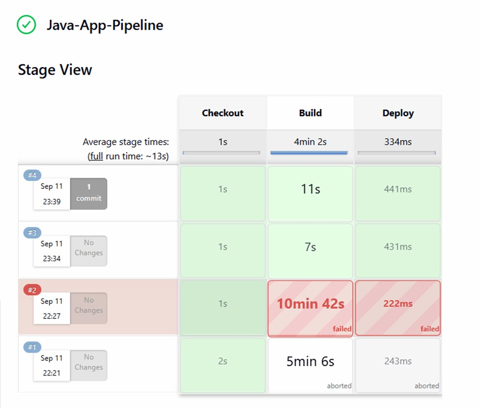
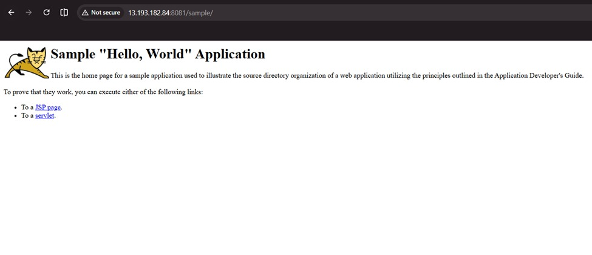

# Jenkins CI/CD Pipeline on AWS EC2

Automated CI/CD pipeline that builds a Java Maven application and deploys it to Apache Tomcat on AWS EC2, triggered automatically via GitHub webhooks on every push to master.

---

## Live Output

### Jenkins Pipeline — All Stages Passed


> Build #4 completed successfully — Checkout (1s) → Build (11s) → Deploy (441ms)

### Application Running on Tomcat


> Sample "Hello World" Java app live at `http://13.193.182.84:8081/sample/`

---

## Architecture

```
Developer pushes code to GitHub (master branch)
                ↓
        GitHub Webhook fires
                ↓
      Jenkins on EC2 (Port 8080)
                ↓
    Stage 1: Checkout — pulls latest code
                ↓
    Stage 2: Build — mvn clean package -DskipTests
                ↓
    Stage 3: Deploy — copies artifact to Tomcat webapps/
                ↓
      App live on Tomcat (Port 8081)
```

---

## Tech Stack

| Tool | Purpose |
|---|---|
| AWS EC2 (Ubuntu) | Cloud server hosting Jenkins + Tomcat |
| Jenkins | CI/CD automation server |
| GitHub + Webhooks | Source control + automatic build trigger |
| Maven | Build and package Java application |
| Apache Tomcat 9 | Application server for deployment |

---

## Pipeline Stages

**Stage 1 — Checkout**  
Jenkins pulls latest code from the GitHub repository (master branch).

**Stage 2 — Build**  
Maven compiles and packages the app using `mvn clean package -DskipTests`.

**Stage 3 — Deploy**  
Compiled `.jar`/`.war` artifact is copied to Tomcat's `webapps/` directory and served automatically.

---

## Setup

### EC2 Security Group (Inbound Rules)
| Port | Purpose |
|---|---|
| 22 | SSH access |
| 8080 | Jenkins dashboard |
| 8081 | Tomcat application |

### Jenkins + Maven + Tomcat Installation
```bash
sudo apt update
sudo apt install -y openjdk-17-jdk jenkins maven git
sudo systemctl start jenkins

# Tomcat
cd /opt
sudo wget https://dlcdn.apache.org/tomcat/tomcat-9/v9.0.85/bin/apache-tomcat-9.0.85.tar.gz
sudo tar -xvf apache-tomcat-9.0.85.tar.gz
sudo mv apache-tomcat-9.0.85 tomcat9
sudo /opt/tomcat9/bin/startup.sh
```

### GitHub Webhook
- GitHub Repo → Settings → Webhooks → Add webhook
- Payload URL: `http://EC2-IP:8080/github-webhook/`
- Content type: `application/json`
- Event: Push events only

---

## Source App

Pipeline builds the Jenkins official sample Java Maven app:  
https://github.com/RadhaRani53/simple-java-maven-app

---

## Key Learnings

- Installed and configured Jenkins on AWS EC2 from scratch
- Connected GitHub to Jenkins using webhooks for automatic push-triggered builds
- Wrote a 3-stage Declarative Jenkinsfile (Checkout → Build → Deploy)
- Deployed Java artifacts to Apache Tomcat automatically on every push
- Debugged failed builds (#2) and fixed pipeline to achieve stable green builds (#3, #4)

---

## Author

**Radha Rani Adepu** · B.Tech CSE (Data Science), HITAM Hyderabad  
[LinkedIn](https://linkedin.com/in/radharaniadepu) · [GitHub](https://github.com/RadhaRani53)
